# Buildathon Dallas 2026 — Credit Strategy for VAYU

> [!NOTE]
> Mapping $3,025+ in partner credits to your remaining tasks, with a realistic 18-hour execution plan.

---

## 1. Partner Credits — What Each One Does

| Partner | Credits | What It Is | Relevance to VAYU |
|---------|---------|------------|--------------------------|
| **Tavily** | $2,000 | AI-optimized web search API (search, extract, crawl). Designed for RAG & AI agents. | ⭐⭐⭐ **HIGH** — Can power real-time EPA/weather data retrieval for your environmental pipeline |
| **Lovable** | $100 | AI full-stack web app builder (generates React + Supabase apps from prompts) | ⭐⭐⭐ **HIGH** — Can rebuild your frontend as a real React app with Supabase DB in hours |
| **Featherless AI** | $25 | Serverless open-source LLM inference (OpenAI-compatible API, thousands of models) | ⭐⭐⭐ **HIGH** — Can power AI-generated SMS outreach (replace your template engine with an LLM agent) |
| **CallFort** | $20 | Voice AI / telephony API (likely similar to Retell/Vapi) | ⭐⭐ **MEDIUM** — Can power Track B manual call queue with AI voice agent for patient outreach |
| **Geodo** | $300 | B2B sales GTM platform (outbound intelligence, pipeline, deal coaching) | ⭐ **LOW** — Not directly relevant to VAYU's healthcare pipeline |
| **GiraffyReach** | $80 | Job application automation (resume, outreach to recruiters) | ❌ **NONE** — Not applicable |
| **Pipecode** | $500 | Data engineering interview prep platform | ❌ **NONE** — Not applicable |
| **Just Videos** | Unlimited | AI video generation (multi-model, short-form video creation) | ⭐⭐ **MEDIUM** — Can create a polished demo/pitch video for judging |

---

## 2. Credits → VAYU Task Mapping

### ⭐ High-Impact Credits (Use These First)

#### Tavily ($2,000) → Real Environmental Data Pipeline

This is your **most valuable credit**. Tavily can replace the hardcoded environmental data with live data retrieval:

| Task | How Tavily Helps | Effort |
|------|-----------------|--------|
| Real-time EPA AQI data | Use Tavily Search to query EPA AirNow for current AQI by ZIP/city | ~2 hrs |
| Weather data ingestion | Search OpenWeather/NWS for temperature, humidity, ozone, barometric | ~2 hrs |
| Wildfire/air quality alerts | Crawl NOAA/EPA alert pages for active advisories in DFW | ~1 hr |
| Research-backed XAI narratives | Extract clinical literature to enrich explainability narratives | ~1 hr |

> [!TIP]
> At Tavily's pricing (~$0.004/search), $2,000 gives you **~500,000 API calls** — far more than you'll need. You could even build a polling loop that refreshes environmental data every 5 minutes for the entire event.

**Concrete implementation**: Build a `tavily_env_feed.py` module that:
1. Queries Tavily for current EPA AQI data for DFW ZIP codes
2. Parses results into your existing `exposure/attenuation.py` format
3. Feeds real numbers into the TFT model input pipeline
4. Serves data via your API layer to the frontend

---

#### Lovable ($100) → Frontend Rebuild as Real Web App

Lovable can transform your 7 standalone HTML pages into a **proper React + Supabase full-stack app**:

| Task | How Lovable Helps | Effort |
|------|------------------|--------|
| Convert static HTML to React app | Prompt Lovable with your existing HTML as reference | ~3-4 hrs |
| Add Supabase database | Lovable auto-provisions Supabase for patient data, scores, audit trail | ~1 hr |
| Real authentication | Supabase Auth for provider login (simulate SMART-on-FHIR OAuth) | ~1 hr |
| Multi-patient routing | Dynamic patient list and detail views from database | ~1 hr |
| API integration | Connect React frontend to your Python backend via fetch() calls | ~2 hrs |

> [!IMPORTANT]
> $100 in Lovable credits is roughly **~20-30 generations/iterations**. Plan your prompts carefully — start with the dashboard, then patient detail, then outreach.

**Recommended approach**: Use Lovable for the frontend shell + database, but keep your existing inline Chart.js visualizations and port them manually into the generated React components.

---

#### Featherless AI ($25) → AI-Powered SMS Outreach (MindStudio Replacement)

Your plan mentions "MindStudio worker agent" for polished multilingual SMS. Featherless can replace that:

| Task | How Featherless Helps | Effort |
|------|----------------------|--------|
| AI SMS generation | Use an open-source LLM (Llama/Mistral) to generate personalized, multilingual patient alerts | ~2 hrs |
| Replace `render_sms()` | Swap template engine for LLM-generated messages with clinical context | ~1 hr |
| Multi-language support | LLM natively handles en/es/vi translation | ~30 min |

**Concrete implementation**: Create an `llm_outreach.py` module that:
1. Takes patient risk context (head, score, climate anomaly, location)
2. Calls Featherless API (OpenAI-compatible) with a system prompt for medical SMS
3. Returns polished, ≤320 char multilingual messages
4. Falls back to your existing `render_sms()` templates if API fails

---

### ⭐ Medium-Impact Credits

#### CallFort ($20) → Track B Voice Outreach

If CallFort is a voice AI platform, it can power your Track B (manual call queue):

| Task | How CallFort Helps | Effort |
|------|-------------------|--------|
| Automated patient calls | AI voice agent calls Track B patients with risk warnings | ~3 hrs |
| Call queue management | Replace decorative "Manual Call Queue" with real call dispatching | ~2 hrs |

#### Just Videos (Unlimited) → Demo/Pitch Video

| Task | How Just Videos Helps | Effort |
|------|----------------------|--------|
| Pitch video | Generate a polished 60-90s product explainer video | ~1-2 hrs |
| Demo walkthrough | Create an animated walkthrough of the pipeline for the presentation | ~1 hr |

---

## 3. Realistic 18-Hour Execution Plan

```mermaid
gantt
    title VAYU — 18-Hour Buildathon Execution
    dateFormat HH:mm
    axisFormat %H:%M

    section Phase 1: API Layer (hrs 0-4)
    FastAPI server + endpoints        :a1, 00:00, 3h
    Tavily env data integration       :a2, 01:00, 2h
    Connect pipeline to API           :a3, 03:00, 1h

    section Phase 2: Frontend (hrs 4-10)
    Lovable React app generation      :b1, 04:00, 3h
    Supabase DB + Auth setup          :b2, 04:00, 1h
    Wire frontend to API              :b3, 07:00, 2h
    Port Chart.js visualizations      :b4, 09:00, 1h

    section Phase 3: AI Features (hrs 10-14)
    Featherless SMS agent             :c1, 10:00, 2h
    CallFort voice outreach           :c2, 12:00, 2h

    section Phase 4: Polish (hrs 14-18)
    End-to-end testing                :d1, 14:00, 2h
    Just Videos pitch video           :d2, 14:00, 2h
    Demo rehearsal + fixes            :d3, 16:00, 2h
```

### Hour-by-Hour Breakdown

#### Phase 1: API Layer + Real Data (Hours 0–4) 🔧
**Goal**: Bridge the frontend ↔ backend gap — this is the #1 priority

| Hour | Task | Credits Used |
|------|------|-------------|
| 0–1 | Set up FastAPI server with core endpoints: `/patients`, `/risk-scores`, `/triage-queue`, `/attributions` | None |
| 1–3 | Build `tavily_env_feed.py` — real EPA AQI + weather data via Tavily API → feed into exposure pipeline | **Tavily** |
| 3–4 | Wire `demo_pipeline.py` stages into API endpoints, add WebSocket for live dashboard updates | None |

---

#### Phase 2: Frontend Rebuild (Hours 4–10) 🖥️
**Goal**: Replace static HTML with a real, dynamic web app

| Hour | Task | Credits Used |
|------|------|-------------|
| 4–5 | Prompt Lovable to generate dashboard + patient detail pages (use existing HTML as reference) | **Lovable** |
| 5–6 | Set up Supabase database schema (patients, risk_scores, consent, outreach_log) + seed data | **Lovable** |
| 6–7 | Generate remaining pages (outreach, analytics, consumer, login) in Lovable | **Lovable** |
| 7–9 | Wire React frontend to FastAPI backend (fetch calls, real-time updates) | None |
| 9–10 | Port Chart.js visualizations (SHAP, risk timeline, triage charts) into React components | None |

---

#### Phase 3: AI-Powered Features (Hours 10–14) 🤖
**Goal**: Replace stubs with real AI-driven outreach

| Hour | Task | Credits Used |
|------|------|-------------|
| 10–12 | Build LLM-powered SMS generator using Featherless AI (multilingual, personalized) | **Featherless** |
| 12–14 | *(If time allows)* Set up CallFort voice agent for Track B patient calls | **CallFort** |

---

#### Phase 4: Polish & Pitch (Hours 14–18) 🎬
**Goal**: Make it demo-ready and presentation-perfect

| Hour | Task | Credits Used |
|------|------|-------------|
| 14–16 | End-to-end testing, bug fixes, edge case handling | None |
| 14–16 | Generate pitch video with Just Videos (run in parallel) | **Just Videos** |
| 16–18 | Demo rehearsal, final UI polish, prepare talking points | None |

---

## 4. What CAN Be Done vs What CANNOT

### ✅ Achievable in 18 Hours (with credits)

| Task | How | Confidence |
|------|-----|-----------|
| API layer (FastAPI) | Standard Python dev, no credits needed | 🟢 95% |
| Real environmental data | Tavily API → EPA/weather data | 🟢 90% |
| React frontend rebuild | Lovable generates the shell | 🟡 75% |
| Database + persistence | Supabase via Lovable | 🟢 85% |
| AI SMS outreach | Featherless LLM inference | 🟢 90% |
| Live demo simulation | Real data flowing through pipeline | 🟡 80% |
| Pitch video | Just Videos unlimited credits | 🟢 95% |

### ⚠️ Stretch Goals (if time allows)

| Task | How | Confidence |
|------|-----|-----------|
| Voice AI patient calls | CallFort ($20 is tight) | 🟡 50% |
| Real SMART-on-FHIR auth | Complex OAuth flow, limited time | 🔴 30% |
| WebSocket live updates | Needs careful frontend wiring | 🟡 60% |

### ❌ NOT Achievable in 18 Hours (regardless of credits)

| Task | Why |
|------|-----|
| **TFT model training** | Requires real EHR + climate training data you don't have, plus GPU hours for proper training |
| **Production deployment** | Docker, CI/CD, monitoring — not buildathon scope |
| **Real EHR integration** | Need a FHIR sandbox (HAPI FHIR), compliance review, test patient data — too complex for 18 hrs |
| **Real SMS delivery** | Need Twilio/SNS account + phone number provisioning + compliance (HIPAA). None of the credits cover this |
| **Model versioning / MLOps** | Post-buildathon infrastructure work |
| **33k ZIP centroid expansion** | Data processing task, not demo-critical |

---

## 5. Credit Budget Summary

| Credit | Allocated To | Est. Usage | Wasted? |
|--------|-------------|-----------|---------|
| **Tavily** ($2,000) | Environmental data pipeline | ~$5-20 | $1,980 surplus — use for extra data enrichment |
| **Lovable** ($100) | Frontend React rebuild | ~$80-100 | None — use it all |
| **Featherless** ($25) | LLM SMS outreach agent | ~$10-25 | Minimal waste |
| **CallFort** ($20) | Voice outreach demo | ~$20 (if used) | Skip if time-constrained |
| **Just Videos** (∞) | Pitch video | Use liberally | None — free |
| **Geodo** ($300) | ❌ Skip | $0 | $300 unused |
| **GiraffyReach** ($80) | ❌ Skip | $0 | $80 unused |
| **Pipecode** ($500) | ❌ Skip | $0 | $500 unused |

> [!IMPORTANT]
> **Effective credits for VAYU: ~$2,145 out of $3,025** (71%). The remaining $880 (Geodo, GiraffyReach, Pipecode) are irrelevant to your healthcare pipeline.
