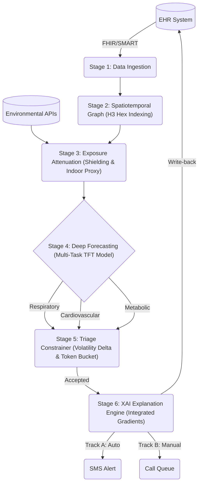
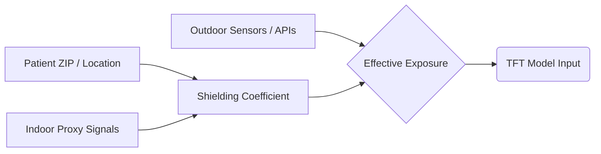
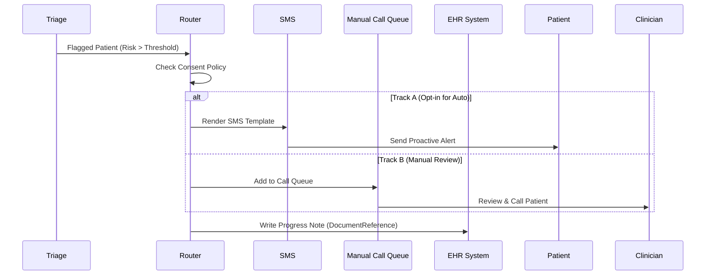

# VAYU Architecture Overview

> [!NOTE]
> This document outlines the architecture and pipeline of the VAYU system based on the `pre_build` implementation and version 1 web interface.

## System Architecture

VAYU is an end-to-end predictive healthcare pipeline that integrates Electronic Health Record (EHR) data with environmental and climate risk models to forecast acute health events.

## The 7-Stage Core Pipeline (`pre_build/`)

The backend pipeline, orchestrated by `demo_pipeline.py`, processes patient data through seven main stages:

### 1. Data Ingestion
Integration with healthcare systems is handled via a FHIR client. The system pulls patient demographics, recent clinical observations, and active medication requests.
- **Key Modules:** `fhir_client.py`, `smart_oauth.py`

### 2. Spatiotemporal Graph
Patient locations (e.g., ZIP codes) are hashed into an H3 hex cell index. This allows the system to accurately map the patient to highly granular environmental and climate events.
- **Key Modules:** `spatial/`

### 3. Exposure Attenuation
To calculate true risk, the system determines the *Effective Exposure* rather than relying solely on outdoor sensors.
- `Effective Exposure = Outdoor × (1 − Shielding Coefficient)`
- An indoor proxy classifies how much time the patient spends indoors, scaling the environmental risk accordingly.

- **Key Modules:** `exposure/`

### 4. Multi-Task Deep AI
At the core is a **Temporal Fusion Transformer (TFT)** predicting risk across three separate clinical heads:
1. Respiratory
2. Cardiovascular
3. Metabolic
The model calculates a **Climate Volatility Delta** representing the specific risk anomaly introduced by sudden environmental shifts (e.g., a wildfire plume).
- **Key Modules:** `model/tft_skeleton.py`, `model/multitask_loss.py`

### 5. Triage Constrainer
Not all high-risk patients can be contacted at once. A **token-bucket system** gates alerts so that clinics only receive notifications for the top fraction of patients (e.g., top 5%) they have the actual capacity to handle on a given day.
- **Key Modules:** `triage/`

### 6. XAI Breakdown (Explainable AI)
The system uses Integrated Gradients to identify the primary drivers behind a specific risk flag. This allows clinicians to see exactly which environmental factors (e.g., PM2.5) or static clinical features triggered the alert.
- **Key Modules:** `explain/`

### 7. Endpoint Outreach & EHR Write-Back
Once a patient clears the triage step, they are routed through a Dual-Track consent system:

- **Track A:** Patient opted into automated notifications; system sends a proactive SMS alert.
- **Track B:** Patient requires manual intervention; system queues a phone call task.
Finally, a FHIR **DocumentReference (Progress Note)** is generated and written directly back into the patient's EHR chart.
- **Key Modules:** `consent/`, `outreach/`, `fhir/progress_note.py`

---

## Additional Components

### Frontend Web Dashboard (`version 1/`)
A prototype user interface consisting of multiple HTML views:
- **Clinic/Admin Views:** `dashboard.html`, `analytics.html`, `patient-detail.html`
- **Patient Views:** `consumer.html`, `login.html`, `plan.html`

### Ablation Studies (`ablation_study/`)
Analytical scripts designed to evaluate model performance under different conditions (e.g., using synthetic baselines versus real-world AQI data) to ensure the robustness of the forecasting model.
