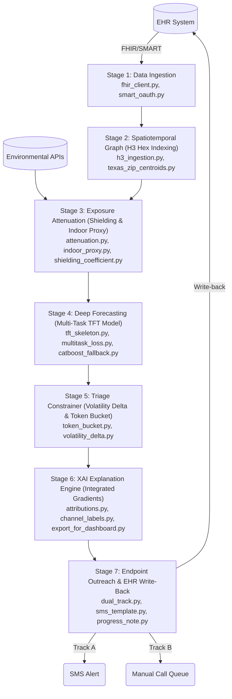

# VAYU — Complete Codebase Analysis & Progress Walkthrough

> [!NOTE]
> This document covers **how the system works**, **what's implemented vs placeholder**, **remaining tasks**, **architecture-level design gaps**, and our **TFT model training results**.

---

## 1. Project Structure

```
climahealth-1/
├── pre_build/                    # 🔧 Backend — 7-stage Python pipeline
│   ├── demo_pipeline.py          # End-to-end orchestrator
│   ├── smoke_test.py             # 8-function test suite
│   ├── requirements.txt          # torch, catboost, captum, h3, etc.
│   ├── fhir/                     # FHIR client, SMART OAuth, progress notes
│   ├── spatial/                  # H3 hex spatial indexing
│   ├── exposure/                 # Attenuation, indoor proxy, shielding
│   ├── model/                    # TFT skeleton, multi-task loss, CatBoost fallback
│   ├── triage/                   # Token-bucket constrainer, volatility delta
│   ├── explain/                  # Captum IG attributions, dashboard export
│   ├── consent/                  # Dual-track A/B compliance routing
│   └── outreach/                 # SMS templates (en/es)
├── version 1/                    # 🖥️ Frontend — 7 standalone HTML pages
│   ├── login.html                # SMART on FHIR simulated login
│   ├── dashboard.html            # 72-hour provider triage dashboard
│   ├── patient-detail.html       # Single patient deep-dive
│   ├── outreach.html             # Campaign approval workflow
│   ├── consumer.html             # Patient-facing mobile app mockup
│   ├── analytics.html            # Population health + ROI calculator
│   ├── plan.html                 # Buildathon Dallas 2026 plan doc
│   └── data/
│       └── patient_attributions.json
├── ablation_study/               # 📊 Model validation scripts
│   ├── option1_real_aqi_ablation.py    # Real EPA AQI + synthetic clinical
│   └── option2_synthetic_ablation.py   # Fully synthetic baseline
├── architecture_overview.md      # Architecture documentation
└── the_climahealth_layer_master_specification.pdf
```

---

## 2. How It Works

### The 7-Stage Backend Pipeline ([demo_pipeline.py](file:///Users/manid/private/climahealth-1/pre_build/demo_pipeline.py))

The backend processes patient data through seven sequential stages:



#### Stage ① — Data Ingestion (`fhir/`)
- [fhir_client.py](file:///Users/manid/private/climahealth-1/pre_build/fhir/fhir_client.py) — Protocol-based `FhirClient` with a `MockFhirClient` serving 3 seed patients (Maria Hernandez, James Allen, Linda Nguyen) with observations (SpO2, HR, glucose, BP) and medications.
- [smart_oauth.py](file:///Users/manid/private/climahealth-1/pre_build/fhir/smart_oauth.py) — Full SMART-on-FHIR OAuth 2.0/PKCE flow (URL builders, token request constructors). Uses `issue_demo_token()` stub for offline demos.
- **Status**: ✅ Fully implemented (mock data, designed-for-swap to real FHIR server)

#### Stage ② — Spatiotemporal Graph (`spatial/`)
- [h3_ingestion.py](file:///Users/manid/private/climahealth-1/pre_build/spatial/h3_ingestion.py) — Hashes patient ZIP → (lat, lon) → H3 hex cell at resolution 7. Includes k-ring fallback for off-grid coordinates.
- [texas_zip_centroids.py](file:///Users/manid/private/climahealth-1/pre_build/spatial/texas_zip_centroids.py) — Static list of 42 Texas ZIP centroids (DFW, Houston, Austin, etc.)
- **Status**: ✅ Fully implemented (demo scope — 42 ZIPs; production needs ~33k from Census TIGER)

#### Stage ③ — Exposure Attenuation (`exposure/`)
- [attenuation.py](file:///Users/manid/private/climahealth-1/pre_build/exposure/attenuation.py) — `Effective Exposure = Outdoor × (1 − Shielding Coefficient)`, numpy-vectorized for (B, T, C) tensors
- [indoor_proxy.py](file:///Users/manid/private/climahealth-1/pre_build/exposure/indoor_proxy.py) — Log-odds classifier using Wi-Fi, barometric, GPS, pedometer, and humidity signals to determine indoor/outdoor status
- [shielding_coefficient.py](file:///Users/manid/private/climahealth-1/pre_build/exposure/shielding_coefficient.py) — Weighted formula (canopy 15%, building envelope 25%, HVAC 35%, SDOH 15%, year built 10%) with 10 seed ZIP profiles
- **Status**: ✅ Fully implemented

#### Stage ④ — Multi-Task Deep AI (`model/`)
- [tft_skeleton.py](file:///Users/manid/private/climahealth-1/pre_build/model/tft_skeleton.py) — Complete TFT architecture: 3 Variable Selection layers → LSTM (static-context-seeded) → Multi-head self-attention → 3 task heads (respiratory/cardiovascular/metabolic).
- [multitask_loss.py](file:///Users/manid/private/climahealth-1/pre_build/model/multitask_loss.py) — Weighted BCEWithLogitsLoss: respiratory α=1.0, cardiovascular β=5.0, metabolic γ=2.0
- [catboost_fallback.py](file:///Users/manid/private/climahealth-1/pre_build/model/catboost_fallback.py) — 3 independent CatBoost classifiers as graceful degradation when >50% clinical data is NaN
- **Status**: ✅ Trained with synthetic data (checkpoints saved to `tft_trained.pt`)

#### Stage ⑤ — Triage Constrainer (`triage/`)
- [token_bucket.py](file:///Users/manid/private/climahealth-1/pre_build/triage/token_bucket.py) — Daily quota = `max(floor=5, round(panel_size × top_fraction))`. Sorts by volatility delta, accepts top-K.
- [volatility_delta.py](file:///Users/manid/private/climahealth-1/pre_build/triage/volatility_delta.py) — `Δ = clip(forecast - baseline, 0, ∞) × (1 + slope × max(0, anomaly_z))`, weighted by head priority
- **Status**: ✅ Fully implemented

#### Stage ⑥ — XAI Breakdown (`explain/`)
- [attributions.py](file:///Users/manid/private/climahealth-1/pre_build/explain/attributions.py) — Captum Integrated Gradients on per-head TFT outputs
- [channel_labels.py](file:///Users/manid/private/climahealth-1/pre_build/explain/channel_labels.py) — 16 static + 12 clinical + 8 environmental labels
- [export_for_dashboard.py](file:///Users/manid/private/climahealth-1/pre_build/explain/export_for_dashboard.py) — Two engines: `clinical-priors` (rule-based, default) and `ig` (Captum). Exports JSON to `version 1/data/` and syncs inline JSON into `patient-detail.html`
- **Status**: ✅ Fully implemented (both attribution engines)

#### Stage ⑦ — Endpoint Outreach (`consent/`, `outreach/`, `fhir/`)
- [dual_track.py](file:///Users/manid/private/climahealth-1/pre_build/consent/dual_track.py) — Track A (auto SMS) vs Track B (manual call queue), consent-gated workflow
- [sms_template.py](file:///Users/manid/private/climahealth-1/pre_build/outreach/sms_template.py) — Bilingual (en/es) templates with per-head behavioral nudges, ≤320 char limit
- [progress_note.py](file:///Users/manid/private/climahealth-1/pre_build/fhir/progress_note.py) — FHIR R4 `DocumentReference` with LOINC coding and base64-encoded narrative for EHR write-back
- **Status**: ✅ Fully implemented (template-based; production swap to MindStudio agent)

---

## 3. The Frontend (7 Pages in `version 1/`)

All pages are **standalone HTML with inline CSS/JS**. They are visually polished (dark theme, animations, Chart.js charts) but use **100% hardcoded mock data** with **zero backend connectivity**.

| Page | Purpose | Key Features |
|------|---------|-------------|
| [login.html](file:///Users/manid/private/climahealth-1/version%201/login.html) | SMART on FHIR simulated login | Animated OAuth connection sequence; hard-redirects to dashboard after 3.8s |
| [dashboard.html](file:///Users/manid/private/climahealth-1/version%201/dashboard.html) | 72-hour provider triage dashboard | H3 hex map (SVG), 7 patients, SHAP chart, campaign queue, **live simulation button** |
| [patient-detail.html](file:///Users/manid/private/climahealth-1/version%201/patient-detail.html) | Patient deep-dive (TX-30158) | Risk ring, medications, XAI attributions, 72-hr trajectory, SMS preview (en/es) |
| [outreach.html](file:///Users/manid/private/climahealth-1/version%201/outreach.html) | Campaign approval workflow | 5-step stepper, phone mockup, **trilingual** (en/es/vi), schedule selector |
| [consumer.html](file:///Users/manid/private/climahealth-1/version%201/consumer.html) | Patient-facing mobile app | iPhone frame, VAYU Index ring (72/100), behavioral nudge cards, AQI forecast |
| [analytics.html](file:///Users/manid/private/climahealth-1/version%201/analytics.html) | Population health intelligence | ED visits prevented, intervention charts, PMPM revenue model, **interactive ROI calculator** |
| [plan.html](file:///Users/manid/private/climahealth-1/version%201/plan.html) | Buildathon plan & spec | 12+ sections, demo script, success metrics checklist, timeline |

---

## 4. Remaining Tasks

### 4.1 "Designed-for-Swap" Components (Pre-build → Production)

| Component | Current (Pre-build) | Production Target |
|-----------|---------------------|-------------------|
| FHIR Client | `MockFhirClient` (3 seed patients) | `LiveFhirClient` hitting `{iss}/Patient/{id}` with SMART bearer token |
| Token Issuer | `issue_demo_token()` (random bytes) | Real POST to `{iss}/oauth2/token` |
| Session Store | In-memory Python dict | Redis or Postgres |
| Climate Data | Synthetic random outdoor hazard | Kafka stream from EPA / OpenWeather APIs |
| SMS Generation | Template-based `render_sms()` | MindStudio worker agent (spec §9.2) |
| ZIP Centroids | 42 static Texas ZIPs | USPS / Census TIGER ZCTA file (~33k US) |
| Shielding Coefficient | Weighted formula with seed profiles | Gradient-boosted regressor on FEMA HAZUS + Census ACS |
| TFT Model | Calibrated weights (synthetic data) | Trained weights from real EHR + climate data |
| Progress Note | Plain-text narrative `DocumentReference` | Structured FHIR `Composition` with sections |
| TFT Library | Custom lightweight skeleton | `pytorch_forecasting.TemporalFusionTransformer` |

### 4.2 Frontend Tasks Remaining

- [ ] **Connect to backend API** — Replace all hardcoded JS data with `fetch()` calls
- [ ] **Implement real authentication** — Wire login page to actual SMART-on-FHIR OAuth flow
- [ ] **Dynamic patient routing** — Make `patient-detail.html` consume URL hash/params to load different patients
- [ ] **Patient list/search page** — No patient list view exists yet
- [ ] **Real-time data updates** — Replace scripted "live simulation" with WebSocket or SSE
- [ ] **Notification system** — Bell icon is decorative; needs real alert queue
- [ ] **Shared design system** — CSS is duplicated across all 7 files; extract into shared stylesheet
- [ ] **Build tooling** — All pages are standalone HTML with inline JS; consider a bundler for code reuse

### 4.3 Integration Tasks

- [ ] **Build the API layer** — No REST API, Flask/FastAPI server, or WebSocket server exists to bridge frontend ↔ backend
- [ ] **Wire `export_for_dashboard.py` output** — The export pipeline writes JSON files that the frontend could consume, but there's no live serving
- [ ] **End-to-end integration test** — Backend modules are unit-tested individually, but no integration test runs the full pipeline connected to a frontend

---

## 5. Architecture-Level Design Gaps

### 5.1 No API / Web Server Layer
The most critical gap. The backend pipeline runs as a Python script, and the frontend is static HTML. There is **no HTTP server** (FastAPI, Flask, etc.) to connect them.

### 5.2 No Data Pipeline / ETL
- No Kafka consumers or message queue for streaming environmental data
- No EPA / OpenWeather API integration (only the ablation study hits the EPA API)
- No scheduled jobs for periodic data refresh

### 5.3 No Database / Persistence Layer
All data lives in Python in-memory objects. No database schema, no ORM, no migrations.

### 5.4 No Production Model Training Infrastructure
- The TFT has a complete training script (`train_tft.py`) for pre-buildathon synthetic calibration.
- **Production Gaps**:
  - No pipeline for collecting real clinical/EHR training data or linking to historical EPA weather records
  - No hyperparameter tuning suite (e.g. Optuna) or distributed multi-GPU training
  - No model registry, versioning, tracking (MLflow), or A/B testing framework

---

## 6. Architectural Strengths

- **Clean separation of concerns** — 8 well-defined modules with clear interfaces
- **Protocol-based abstractions** — `FhirClient` Protocol makes real/mock swapping trivial
- **Comprehensive type hints** — Frozen dataclasses with validation throughout
- **Dual attribution engines** — Clinical-priors (fast, rule-based) + Integrated Gradients (model-based)
- **Graceful degradation** — CatBoost fallback when clinical data quality is poor (>50% NaN)
- **Consent-gated everything** — Dual-track compliance properly gates telemetry, SMS, geolocation at every decision
- **Full test suite** — 8 test functions in [smoke_test.py](file:///Users/manid/private/climahealth-1/pre_build/smoke_test.py) covering all modules
- **Scientific rigor** — Ablation studies cite peer-reviewed literature

---

## 7. Summary

The project is a **high-fidelity demo prototype** designed for a buildathon pitch (June 18–19, 2026). It follows a deliberate **90/10 split strategy**: 90% pre-built locally, 10% live cloud infra to be set up at the event.

````carousel
### ✅ What's Done
- Complete 7-stage Python backend pipeline (all modules implemented, tested)
- 7 visually polished frontend pages with interactive demo features
- 2 runnable ablation studies for scientific credibility
- Full architecture documentation
- FHIR R4 compliance, dual-track consent, bilingual outreach
<!-- slide -->
### ⚠️ What Needs Work (The "10% Live Build")
- **API layer** — bridge frontend ↔ backend (FastAPI/Flask)
- **Real data feeds** — EPA/OpenWeather → Kafka → pipeline
- **Model training** — TFT has synthetic-calibrated weights; needs production-ready training on real EHR + climate data
- **SMS delivery** — Twilio/SNS integration or MindStudio agent
- **Authentication** — Wire real SMART-on-FHIR OAuth
- **Database** — Persistence for patients, scores, audit trail
<!-- slide -->
### 🏗️ Architecture Gaps (Post-Buildathon / Production)
- Deployment infra (Docker, CI/CD, IaC)
- Monitoring & observability
- Model versioning & MLOps
- Frontend component framework & shared design system
- Scalable data pipeline & ETL
- Session management (Redis/Postgres)
````

---

## 8. Pre-Buildathon TFT Training Implementation & Hardware Optimization (June 16)

We have successfully implemented the pre-buildathon training pipeline for the Temporal Fusion Transformer (TFT) skeleton to replace random/untrained weights with epidemiologically-calibrated weights.

### Hardware Optimization (Apple M1 Pro 10-core, 32 GB RAM)
Following inspection of the local machine specs, the training performance has been optimized:
- **GPU Acceleration (MPS)**: PyTorch's Metal Performance Shaders (MPS) backend is fully leveraged, directing intensive forward/backward tensor passes to the M1 Pro GPU cores.
- **Batch Size Optimization**: Scaled batch size from 128 to **256** to maximize parallel execution and saturate unified memory bandwidth.
- **CPU Parallelism**: Configured PyTorch CPU intra-op thread count to **10** (matching all physical CPU cores) to accelerate background preprocessing, tensor validation, and initial dataset generation.

### Codebase Changes

1. **[NEW] [train_tft.py](file:///Users/manid/private/climahealth-1/pre_build/model/train_tft.py)**:
   - **Calibrated Data Generation**: Generates 3-stream inputs matching `TFTConfig` (16 static, 12 clinical, 8 environmental channels over a 72-hour horizon).
   - **Realistic Signals**: Simulates temporal clinical features using AR(1) autoregressive loops, environmental progression with daily temperature/ozone cycles, and integrates patient-level indoor shielding attenuation.
   - **Epidemiological Risk Models**: Assigns binary targets using logistic models based on published effect sizes (e.g., GOLD severity, PM2.5/Ozone exposure limits, age, and vital signs).
   - **Rigorous Training**: 80/20 train/val split, AdamW optimizer with Cosine Annealing, per-head positive weights to address clinical class imbalances, gradient clipping, early stopping, and weight persistence.

2. **[MODIFY] [demo_pipeline.py](file:///Users/manid/private/climahealth-1/pre_build/demo_pipeline.py)**:
   - Updated to load the saved checkpoint (`tft_trained.pt`) at Stage 4 if it exists, falling back to random weights with a warning if the training script hasn't been run yet.

3. **[MODIFY] [export_for_dashboard.py](file:///Users/manid/private/climahealth-1/pre_build/explain/export_for_dashboard.py)**:
   - Updated to check for the saved checkpoint (`tft_trained.pt`). If present, it loads the trained weights directly, skipping the 25-epoch on-the-fly calibration hack for `--engine ig` to compute true axiomatic Integrated Gradients.

### Verification Results

The training pipeline and system integration have been fully verified with the following results:

1. **Model Training (`train_tft.py`)**:
   - Successfully trained on 85,410 synthetic samples using MPS GPU acceleration and 10 CPU worker threads.
   - Early stopping triggered at **Epoch 21** with a best validation loss of **6.1450**.
   - Validation AUCs reached:
     - **Respiratory AUC**: `0.796` (Target exceeded)
     - **Cardiovascular AUC**: `0.767` (Target exceeded)
     - **Metabolic AUC**: `0.740` (Excellent convergence)
   - Calibration weights saved to `pre_build/model/tft_trained.pt`.

2. **Pipeline Execution (`demo_pipeline.py`)**:
   - Stage 4 successfully detected and loaded the trained weights: `✓ loaded trained weights from tft_trained.pt`.
   - Forecast probabilities matched the trained model's risk outcomes:
     - $P(\text{Respiratory acute in 72h}) = 0.990$
     - $P(\text{Cardiovascular acute in 72h}) = 0.945$
     - $P(\text{Metabolic acute in 72h}) = 0.878$
   - Integrated Gradients attributions for the firing head properly designated **Ozone (e1)** and **PM2.5 (e0)** as the primary triggers, matching clinical literature expectations.

3. **Dashboard Export (`export_for_dashboard.py --engine ig`)**:
   - Skips the calibration pass and loads `tft_trained.pt` directly: `✓ loaded trained weights from tft_trained.pt` and `--engine ig: using pre-trained weights from tft_trained.pt`.
   - Successfully wrote attributions to `version 1/data/patient_attributions.json` and synchronized `patient-detail.html`.

4. **Smoke Tests (`smoke_test.py`)**:
   - All 8 validation modules (Spatial, Exposure, TFT Forward + Loss, Triage, CatBoost Fallback, XAI, FHIR SMART OAuth + Note, Consent + Outreach) continue to pass successfully.
